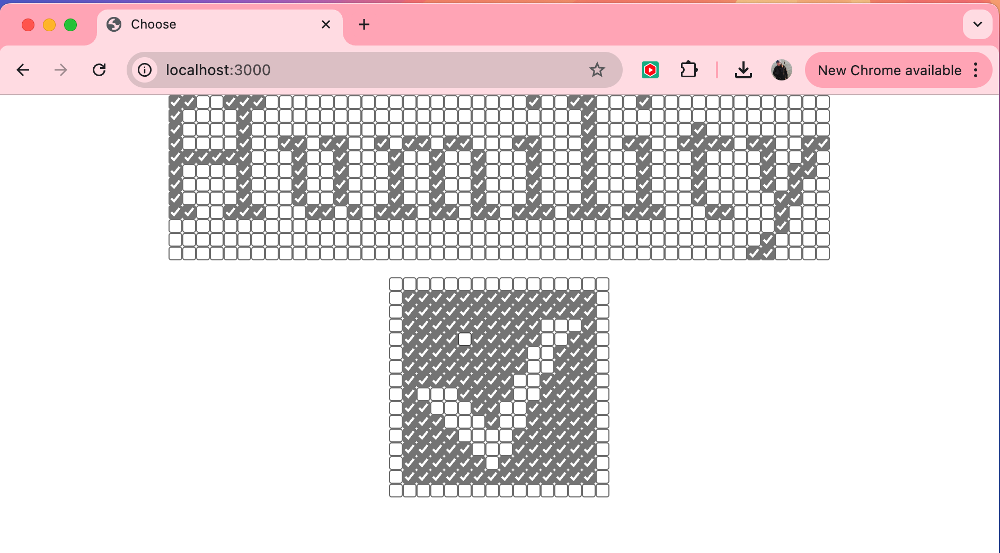

# International Form‑Art Competition (1997) — 2025 Revival
_A single‑file resurrection of my winning entry_

> Animated checkbox art & scrolling dot‑matrix text, faithfully ported from 1997 JavaScript/HTML to today’s evergreen browsers.  
> **No frameworks, no build step — just open `index.html`.**

[Live demo on Vercel](https://formart-1997-choose.vercel.app/)


---

## 📜 Background
This project re‑implements my submission that won the first **International Form‑Art Competition** (1997).  
The original relied on early‑web quirks (`document.layers`, framesets, timed `document.write`), and no longer runs in modern browsers. Code is available to view in the archive directory, if you are really that much of a masochist.

This remake reproduces every behaviour — the scrolling “either/or” messages, the interactive 16 × 16 grid that flips between ☐ and ✓, and the grey‑accent checkboxes — using plain, standards‑compliant JavaScript and fewer than 15 lines of CSS.

---

## 🚀 Quick start

```bash
git clone https://github.com/kassschmitt/choose.git   # or your fork
cd choose
npx serve .                         # any static server works
# open http://localhost:3000
```

---

## 📦 Deployment
The site is purely static, so **any** host that serves `index.html` works.

| Host | Steps |
|------|-------|
| **Vercel** | Import repo → framework **Other** → *Deploy* |
| **GitHub Pages** | Settings → Pages → Source: **main / root** |
| **Netlify / Surge / S3** | Drop the folder and publish |

---

## 🔧 Configuration
Small tweaks live at the top of `index.html`.

| Variable | Purpose | Default |
|----------|---------|---------|
| `FRAME_DELAY` | Scroll frame rate | `35` |
| `UNCHECKED_THRESHOLD` | Ticks before ☐ flips to ✓ | `93` |
| `CHECKED_THRESHOLD` | Unticks before ✓ flips to ☐ | `61` |
| 'MATRIX_ROWS' | height of scroller | 12 (included font will only work with this value | 
| 'MATRIX_COLS' | width of scroller | 48 (change this as you like) | 

---

## 📄 License
Released under the **MIT License**.  
Original 1997 assets © 1997 Kass Schmitt, relicensed under MIT for preservation.  
See [`LICENSE`](LICENSE) for full text.

---

## 🙏 Acknowledgements
* Alexei Shulgin for inventing the Form Art artform.
* C3 Budapest for hosting the [1997 Form Art competition](https://www.c3.hu/collection/form/).  
* James Stevens for founding and running the legendary [Backspace](https://bak.spc.org/) on which this work was hosted, followed by his Sisyphean efforts to preserve its legacy.
* Fellow entrants who pioneered “Form Art”.  
* Rachel Greene, who saw fit to include Form Art (including my entry) in her 2004 book [Internet Art](https://www.amazon.com/Internet-Art-World-Rachel-Greene/dp/0500203768)
* Yoz Grahame, who helped debug my wonky javascript in a memorable all-nighter.
* View‑source enthusiasts everywhere.


